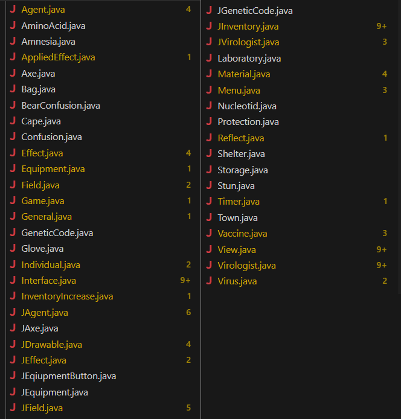
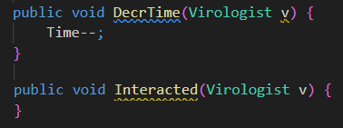

# SonarLint által észlelt hibák átnézése/javítása

Az analízis után rengeteg hibát jelzett a SonarLint:

### Típuslekérdezés

Egy csúnya álcázott típuslekérdezést lecseréltem visitor patternre.

### Absztrakt osztályok konstruktorai

Az absztrakt konstruktorok láthtóságát publicról protectedre cseréltem.

### Default switch ágak

A switch blokkokhoz default ágakat adtam a váratlan inputok elkerülésének érdekében.

### Önassignment

Javítottam egy settert, amiben a kapott paraméter helyett önmagát állította be egy változó. Sehol nem használtuk, de később nagy fejfájást okozhatott volna.

### Virtuális függvények
A hibák közül sok csak virtuális függvények nem használt paramétereit vagy üres implementációit jelezte, amikre szükség van override-ok miatt. Ezekkel nem foglalkoztam.

### Kisebb módosítások:

- Kiszerveztem néhány többször használt string literálist
- Kiszerveztem egy lokális random szém generátort
- Átneveztem néhány összezavaró vátozót

### Törölve:

- Felegesen bentmaradt osztályok
- Nem használt függvények
- Kikommentezett kódsorok
- Nem használt lokális változók
